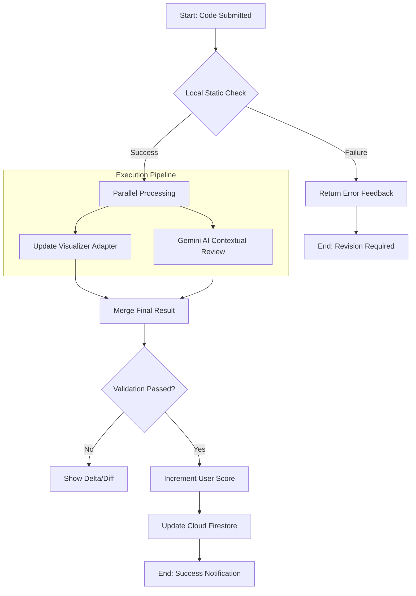

# FullIT: System Architecture & Technical Specifications

## 1. Project Overview
FullIT (StackMaster) is a high-fidelity simulator for software engineers. It bridges the gap between theoretical knowledge and enterprise-grade implementation by providing a visual, code-centric learning environment.

## 2. Use Case Diagram
This diagram outlines the primary interactions between the User and the System.

```mermaid
useCaseDiagram
    actor "Software Engineer" as User
    actor "Administrator" as Admin
    actor "Gemini AI" as AI
    actor "Firebase" as Backend

    package "FullIT System" {
        usecase "Authenticate (Google SSO)" as UC1
        usecase "Browse Engineering Tracks" as UC2
        usecase "Execute Code Lab" as UC3
        usecase "View System Visualization" as UC4
        usecase "Receive AI Feedback" as UC5
        usecase "Monitor Progress" as UC6
        usecase "Manage Users" as UC7
        usecase "Manage Scores" as UC8
        usecase "Reset User Progress" as UC9
    }

    User --> UC1
    User --> UC2
    User --> UC3
    User --> UC6
    
    Admin --> UC7
    Admin --> UC8
    Admin --> UC9
    
    UC1 ..> Backend : verify
    UC3 ..> AI : evaluate
    UC3 ..> UC4 : update state
    UC5 -- AI
    UC6 ..> Backend : persist data
    UC7 ..> Backend : update/delete
    UC8 ..> Backend : update score
    UC9 ..> Backend : clear tasks
```

## 3. BPMN 2.0 Process Flow (Task Submission)
This represents the "Business Logic" of a single code submission event.



## 4. Data Engineering Lifecycle
### Ingestion & Stream
- **Event:** `onCodeSubmit` trigger.
- **Payload:** { code: string, taskId: string, userId: string, timestamp: ISO8601 }.

### Processor Layer
- **Logic Engine:** Uses a **Strategy Pattern** to apply specific rules (Regex, Lexical Analysis) before hitting the LLM.
- **AI Orchestrator:** Sanitizes code input and provides engineering-context templates to Gemini.

### Storage & Analytics
- **Atomic Writes:** User scores are updated via Firestore transactions to prevent race conditions during achievement unlocks.
- **Denormalized Schema:** Task metadata is cached locally for 0ms latency, while user progress is synced for cross-device persistence.
