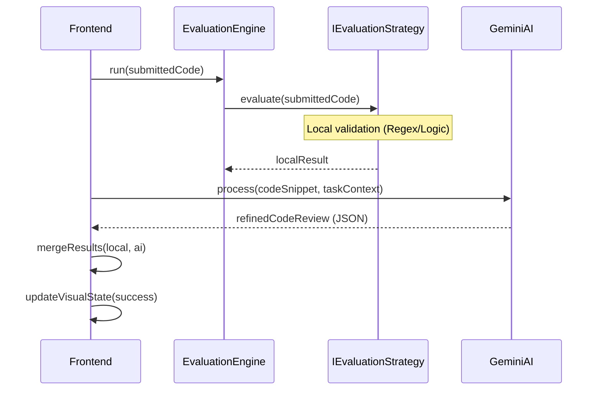

# Enterprise Project Architecture: Java UML Diagrams

This document provides the standard UML representations for the final project submission, demonstrating the structural integrity of the "StackMaster" enterprise system using Java Enterprise conventions.

## 1. Class Diagram (Java Enterprise Patterns)

## 2. Sequence Diagram (Java Task Submission Flow)

## 3. Justification for Enterprise Standards
*   **Separation of Concerns:** Components like `TaskView` do not know *how* tasks are fetched or evaluated; they only interact with standard interfaces.
*   **Loose Coupling:** The `Strategy` pattern allows us to update the "Rules of the Lab" without modifying the UI layer.
*   **Scalability:** The `Factory` pattern ensures we can pivot to a cloud-based Database provider for task data with zero downtime and minimal code changes.
