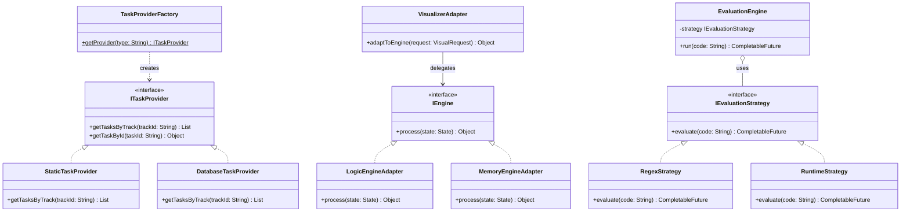
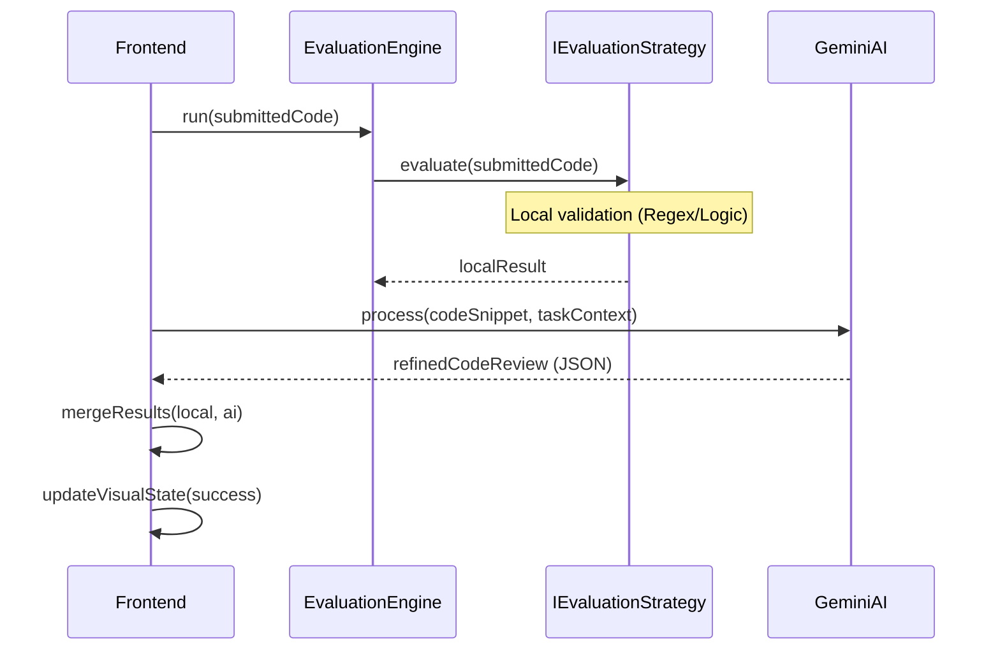
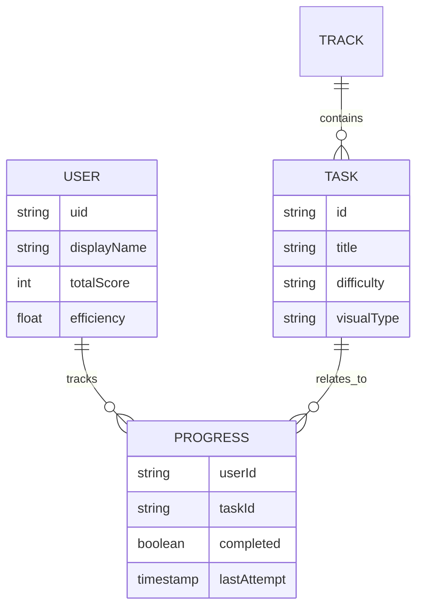

# Enterprise Project Architecture: Java UML Diagrams

This document provides the standard UML representations for the final project submission, demonstrating the structural integrity of the "StackMaster" enterprise system using Java Enterprise conventions.

## 1. Class Diagram (Java Enterprise Patterns)



## 2. Sequence Diagram (Java Task Submission Flow)



## 3. Component Diagram
This diagram shows the high-level organization of the FullIT system modules.

```mermaid
componentDiagram
    [User Browser] as UB
    component [React Frontend] {
      [Task Engine] as TE
      [Visualizer Adapter] as VA
      [Auth Manager] as AM
    }
    database [Firestore]
    [Gemini AI API] as AI
    
    UB --> AM : login
    UB --> TE : writes code
    TE --> VA : triggers visuals
    TE --> AI : requests review
    AM --> Firestore : sync profile
    TE --> Firestore : save progress
```

## 4. Entity Relationship Diagram (Firestore Schema)
While Firestore is NoSQL, our data architecture follows this relational model.



## 5. Justification for Enterprise Standards
*   **Separation of Concerns:** Components like `TaskView` do not know *how* tasks are fetched or evaluated; they only interact with standard interfaces.
*   **Loose Coupling:** The `Strategy` pattern allows us to update the "Rules of the Lab" without modifying the UI layer.
*   **Scalability:** The `Factory` pattern ensures we can pivot to a cloud-based Database provider for task data with zero downtime and minimal code changes.
